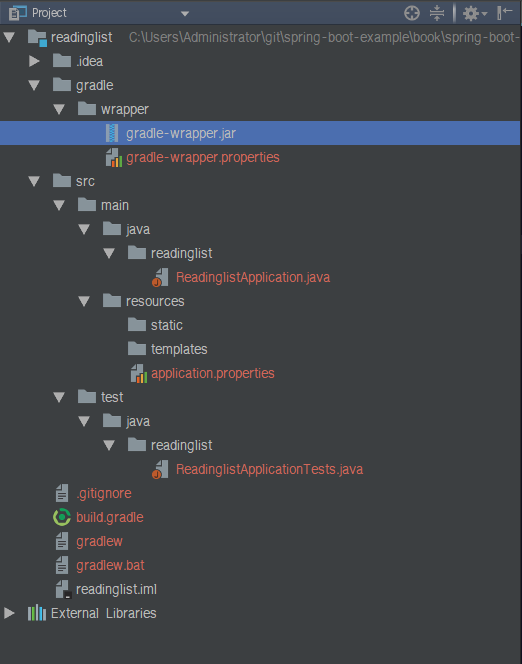

# ch02 스프링 부트 사용하기

## index
- <a href="#2.1">2.1 스프링 부트 사용하기</a>
- <a href="#2.2">2.2 스타터 의존성 사용하기</a>


<div id="2.1"></div>

## 2.1 스프링 부트 사용하기

> Spring cli  

```
$spring init -d=web,thymeleaf, data-jpa,h2 --groupId=com.manning \
--artifactId=readinglist --name="Reading List" --package-name=readinglist \
--description="Reading List Demo" --build gradle readinglist  
```

### 2.1.1 갓 초기화한 스프링 부트 프로젝트 살펴보기

    

- build.gradle : 그레이들 빌드 명세
- gradlew : 그레이들 레퍼
- ReadingListApplication.java : 어플리케이션의 부트스트랩 클래스이자  
주 스프링 구성 클래스  
- application.properties : APP과 스프링 부트 프로퍼티를 구성하는 파일  
- ReadingListApplicationTest.java : 기본 통합 테스트 클래스

**스프링 부트스트래핑**  

> ReadlingListApplication.java  

```
package readinglist;

import org.springframework.boot.SpringApplication;
import org.springframework.boot.autoconfigure.SpringBootApplication;

@SpringBootApplication // 컴포넌트 검색과 자동 구성 활성화
public class ReadingListApplication {

	public static void main(String[] args) {
    // 애플리케이션 부트스트랩
		SpringApplication.run(ReadingListApplication.class, args);
	}
}
```  

1. @SpringBootApplication  
; 스프링 컴포넌트 검색 + 스프링 부트 자동 구성을 활성화  
아래 기능을 묶은 것

- 스프링의 @Configuration  
: 스프링의 자바 기반 구성 클래스로 지정.
- 스프링의 @ComponentScan  
: 컴포넌트 검색 기능을 활성화해서 웹 컨트롤러 클래스나 다른 컴포넌트  
클래스들을 자동으로 검색하여 빈으로 등록
- 스프링부트의 @EnabledAutoConfiguration  
: 이 구성 한 줄로 스프링 부트의 자동 구성이 일어나 수많은 구성 코드를 대체  

> 애플리케이션 빌드 및 실행  

```$ gradle bootRun  ```  

```
$gradle build
$java -jar build/libs/readinglist-0.0.1-SNAPSHOT.jar
```   

**스프링 부트 애플리케이션 테스트**  
**애플리케이션 프로퍼티 구성**  

### 2.1.2 스프링 부트 프로젝트 빌드 파헤치기  

> 스프링 부트 그레이들 플러그인 사용  

```
buildscript {
	ext {
		springBootVersion = '2.0.0.RC2'
	}
	repositories {
		mavenCentral()
		maven { url "https://repo.spring.io/snapshot" }
		maven { url "https://repo.spring.io/milestone" }
	}
	dependencies {
    // 스프링 부트 플러그인 의존성
		classpath("org.springframework.boot:spring-boot-gradle-plugin:${springBootVersion}")
	}
}

apply plugin: 'java'
apply plugin: 'eclipse'
apply plugin: 'org.springframework.boot' // 스프링 부트 플러그인 적용
apply plugin: 'io.spring.dependency-management'

group = 'com.manning'
version = '0.0.1-SNAPSHOT'
sourceCompatibility = 1.8
targetCompatibility = 1.8

repositories {
	mavenCentral()
	maven { url "https://repo.spring.io/snapshot" }
	maven { url "https://repo.spring.io/milestone" }
}


dependencies {
  // 스타터 의존성
	compile('org.springframework.boot:spring-boot-starter-data-jpa')
	compile('org.springframework.boot:spring-boot-starter-thymeleaf')
	compile('org.springframework.boot:spring-boot-starter-web')
	runtime('org.springframework.boot:spring-boot-devtools')
	runtime('com.h2database:h2')
	compileOnly('org.projectlombok:lombok')
	testCompile('org.springframework.boot:spring-boot-starter-test')
}

```  

> pom.xml  

```
<?xml version="1.0" encoding="UTF-8"?>
<project xmlns="http://maven.apache.org/POM/4.0.0" xmlns:xsi="http://www.w3.org/2001/XMLSchema-instance"
	xsi:schemaLocation="http://maven.apache.org/POM/4.0.0 http://maven.apache.org/xsd/maven-4.0.0.xsd">
	<modelVersion>4.0.0</modelVersion>

	<groupId>com.manning</groupId>
	<artifactId>readingList</artifactId>
	<version>0.0.1-SNAPSHOT</version>
	<packaging>jar</packaging>

	<name>demo</name>
	<description>Reading List Demo</description>

	<parent> <!-- 부모 스타터에서 버전 상속 -->
		<groupId>org.springframework.boot</groupId>
		<artifactId>spring-boot-starter-parent</artifactId>
		<version>1.5.10.RELEASE</version>
		<relativePath/> <!-- lookup parent from repository -->
	</parent>

	<properties>
		<project.build.sourceEncoding>UTF-8</project.build.sourceEncoding>
		<project.reporting.outputEncoding>UTF-8</project.reporting.outputEncoding>
		<java.version>1.8</java.version>
	</properties>

	<dependencies>
		<dependency>
			<groupId>org.springframework.boot</groupId>
			<artifactId>spring-boot-starter-data-jpa</artifactId>
		</dependency>
		<dependency>
			<groupId>org.springframework.boot</groupId>
			<artifactId>spring-boot-starter-thymeleaf</artifactId>
		</dependency>
		<dependency>
			<groupId>org.springframework.boot</groupId>
			<artifactId>spring-boot-starter-web</artifactId>
		</dependency>

		<dependency>
			<groupId>com.h2database</groupId>
			<artifactId>h2</artifactId>
			<scope>runtime</scope>
		</dependency>
		<dependency>
			<groupId>org.springframework.boot</groupId>
			<artifactId>spring-boot-starter-test</artifactId>
			<scope>test</scope>
		</dependency>
	</dependencies>

	<build>
		<plugins>
			<plugin>
				<groupId>org.springframework.boot</groupId>
				<artifactId>spring-boot-maven-plugin</artifactId>
			</plugin>
		</plugins>
	</build>
</project>
```  

=> spring-boot-starter-parent를 부모로 지정  
=> 메이븐의 의존성 관리 기능으로 자주 사용하는 라이브러들의 의존성 버전을  
상속받을 수 있어서 의존성을 선언할 때 버전을 명시X  

---  

<div id="2.2"></div>

## 2.2 스타터 의존성 사용하기  

---

### 2.3.3 무슨 일이 일어났을까?  

=> 존재하지 않는 구성으로 자동 구성을 설명하기는 쉽지 않고, 꼭 해야 하는 애플리케이션  
코드 작성을 살펴보기  

=> APP에 Spring boot를 도입하면, 구성 클래스 몇 개를 포함하는 JAR 파일인  
spring-boot-autoconfigure를 추가  
=> spring 4.0에서 도입한 조건부 구성(Conditional Configuration) 지원을 사용하기  
때문에 더 특별해질 수 있었음  

> 자신만의 조건을 작성하는 방법(Condition 인터페이스 상속)  

```
package readinglist;

import org.springframework.context.annotation.Condition;
import org.springframework.context.annotation.ConditionContext;
import org.springframework.core.type.AnnotatedTypeMetadata;

public class JdbcTemplateCondition implements Condition {

    @Override
    public boolean matches(ConditionContext context, AnnotatedTypeMetadata metadata) {
        try {
            context.getClassLoader().loadClass("org.springframework.jdbc.core.JdbcTemplate");
            System.out.println("exist JdbcTemplate");
            return true;
        } catch (Exception e) {
            return false;
        }
    }
}
```  

> 빈 선언  

```
// JdbcTemplateCondition의 matches가 true일때만 MyService 빈 생성
@Conditional(JdbcTemplateCondition.class)
@Bean
public MyService myService() {
		...
}
```  

> 자동 구성에서 사용하는 조건 에너테이션  

<table>
	<tr>
		<th>조건 애너테이션</th> <th>구성을 적용하는 조건</th>		
	</tr>
	<tr>
		<td>@ConditionalOnBean</td>
		<td>대상 빈을 구성함</td>
	</tr>
	<tr>
		<td>@ConditionalOnMissingBean</td>
		<td>대상 빈을 아직 구성하지 않음</td>
	</tr>
	<tr>
		<td>@ConditionalOnClass</td>
		<td>대상 클래스가 클래스패스에 있음</td>
	</tr>
	<tr>
		<td>@ConditionalOnMissingClass</td>
		<td>대상 클래스가 클래스패스에 없음</td>
	</tr>
	<tr>
		<td>@ConditionalOnExpression</td>
		<td>스프링 표현식 언어(SpEL)가 참(true)</td>
	</tr>
	<tr>
		<td>@ConditionalOnJava</td>
		<td>자바 버전이 특정 버전 또는 버전 범위에 맞음</td>
	</tr>
	<tr>
		<td>@ConditionalJndi</td>
		<td>JNDI InitialContext가 사용 가능하고, 선택적으로 지정한 JNDI위치가 있음</td>
	</tr>
	<tr>
		<td>@ConditionalOnProperty</td>
		<td>지정한 구성 프로퍼티가 기대하는 값을 가짐</td>
	</tr>
	<tr>
		<td>@ConditionalOnResource</td>
		<td>지정한 리소스가 클래스패스에 있음</td>
	</tr>
	<tr>
		<td>@ConditionalOnWebApplication</td>
		<td>애플리케이션이 웹 애플리케이션임</td>
	</tr>
	<tr>
		<td>@ConditionalOnNotWebApplication</td>
		<td>애플리케이션이 웹 애플리케이션이 아님</td>
	</tr>
</table>

> DataSourceAutoConfiguration 중 일부

```
package org.springframework.boot.autoconfigure.jdbc;

...

@Configuration
@ConditionalOnClass({ DataSource.class, EmbeddedDatabaseType.class })
@EnableConfigurationProperties(DataSourceProperties.class)
@Import({ DataSourcePoolMetadataProvidersConfiguration.class,
		DataSourceInitializationConfiguration.class })
public class DataSourceAutoConfiguration {
	...
```  

=> @Configuration 어노테이션이 붙은 클래스로 다른 구성 클래스에서 추가적으로  
구성을 가져오며, 자체적으로도 빈을 몇 개 정의

> 예제와 직접 관련이 있는 추린 자동 구성  

- H2가 클래스패스에 있으므로 내장 H2 데이터베이스를 생성  
(생성하는 빈 타입은 javax.sql.DataSource && DataSource는 하이버네이트 같은 JPA  
구현체가 데이터베이스에 접속할 때 필요)  

- 하이버네이트 엔티티 매니저(Entity Manager)가 (스프링 데이터 JPA로 전이적으로)  
클래스패스에 있으므로(스프링의 LocalContainerEntityManagerFactoryBean과  
JpaVendorAdapter를 포함) 하이버네이트를 다룰 때 필요한 빈을 자동 구성  

- 스프링 데이터 JPA가 클래스패스에 있으므로 리포지토리 인터페이스에서 구현체를  
자동으로 생성하려고 스프링 데이터 JPA를 구성한다  

- Thymeleaf가 클래스패스에 있으므로 Thymeleaf가 스프링 MVC의 뷰 옵션으로 구성  
(Thymeleaf 템플릿 리졸버, 템플릿 엔진, 뷰 리졸버 포함) 템플릿 리졸버는 클래스패스의  
루트를 기준으로 /templates 위치에 있는 템플릿을 해석하도록 구성  

- 웹 스타터 의존성 덕분에 스프링 MVC가 클래스패스에 있으므로 스프링 DispatcherServlet  
을 구성하고 스프링 MVC를 활성화 한다  

- 예제는 스프링 MVC 웹 애플리케이션이므로 리소스 핸들러는 클래스패스의 루트를 기준으로  
/static 위치에 있는 정적 콘텐츠를 제공하도록 등록  
(리소스 핸들러는 /public, /resources, /META-INF/resources의 정적 콘텐츠도 제공)  

- (웹 스타터 의존성 덕분에 전이적으로) 톰캣이 클래스패스에 있으므로 8080 포트에서 수신  
대기하는 내장 톰캣 컨테이너를 시작  

=> **스프링 부트 자동 구성이 스프링을 구성하는 일을 하므로, APP를 작성하는일에만 집중**  

---

<div id="2.4"></div>

## 2.4 요약  

- 스프링 부트 스타터 의존성과 자동 구성을 이용하면 스프링 APP을 더 빠르고 쉽게 개발  
- 스타터 의존성은 특정 라이브러리나 버전보다는 APP에 필요한 기능 유형에 집중할 수 있음
- 자동 구성을 이용하면 보일러플레이트 구성을 직접 하지 않아도 됨


<br><br><br><br><br><br><br><br><br><br><br><br>

---
