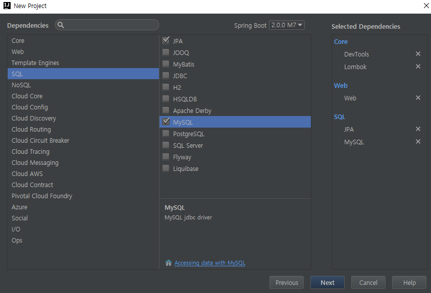
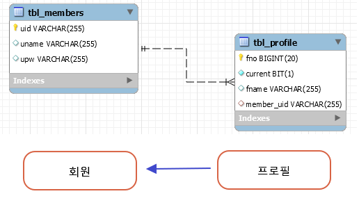

## 4 다양한 연관 관계 처리
- 객체 간 연간관계 설정
- 단방향, 양방향 관계의 이해
- JPQL을 이용한 @Query 처리와 Fetch JOIN(스프링 부트 2.0.0)

### index

- <a href="#4.1">4.1 연관관계 처리의 순서 & 사전 설계 </a>
- <a href="#4.2">4.2 회원과 프로필 사진의 관계 - 단방향 처리1 </a>
- <a href="#4.3">4.3 자료실과 첨부 파일의 관계 - 단방향2 </a>
- <a href="#4.4">4.4 게시물과 댓글의 관게 - 양방향 </a>

---

### 4.1 연관관계 처리의 순서 & 사전 설계

- 필요한 각각의 클래스 정의
- 각 클래스의 연관관계에 대한 설정 추가
  - '일대다','다대다'등의 연관관계 설정
  <table>
    <tr>
      <th>일대일@OneToOne</th>
      <th>일대다@OneToMany</th>
    </tr>
    <tr>
      <th>다대일@ManyToOne</th>
      <th>다대다@ManyToMany</th>
    </tr>    
  </table>  
  - 단방향, 양방향 설정
  <table>
    <tr>
      <th>단방향(Unidirectional)참조</th>
      <td>한쪽의 클래스만이 다른 클래스의 인스턴스를 참조</td>
    </tr>
    <tr>
      <th>양방향(Bidirectional) 참조</th>
      <td>양쪽 클래스 모두 다른 클래스의 인스턴스 참조</td>
    </tr>
  </table>  
- Database에 원하는 형식의 테이블이 만들어지는 지 확인(Hibernate)   
- 테스트 코드를 통해 동작 확인(쿼리문 등)

#### 4.1.1 관계형 데이터베이스 설계와 JPA
(p.131 참조)  
- 중심이 되는 데이터 결정(회원,상품 등)  
=> 회원 / 상품 각 더미 데이터
- 중심 데이터 간의 상호 작용(동작과 히스토리)  
e.g) 회원의 상품 구매  
=> 회원 / 상품 / 구매 더미 데이터
- 연관관계의 설정  
=> 회원 / 상품 / 구매 연관관계 설정(일대다 등)

---

### Project initializer

### 4.2 회원과 프로필 사진의 관계 - 단방향 처리1

> Member.java

<pre>
package org.zerock.domain;

import lombok.EqualsAndHashCode;
import lombok.Getter;
import lombok.Setter;
import lombok.ToString;

import javax.persistence.Entity;
import javax.persistence.Id;
import javax.persistence.Table;

@Getter @Setter @ToString @EqualsAndHashCode(of="uid")
@Entity
@Table(name="tbl_members")
public class Member {
    @Id
    private String uid;
    private String upw;
    private String uname;
}
</pre>

> Profile.java

<pre>
package org.zerock.domain;

import lombok.EqualsAndHashCode;
import lombok.Getter;
import lombok.Setter;
import lombok.ToString;

import javax.persistence.\*;

@Getter@Setter
@ToString(exclude = "member")
@EqualsAndHashCode(of="fno")
@Entity
@Table(name="tbl_profile")
public class Profile {
    // GenerationType.AUTO를 이용하면 hibernate_sequence라는 테이블 생성하고 번호를 유지
    @Id
    @GeneratedValue(strategy = GenerationType.IDENTITY)
    private Long fno;

    private String fname;

    private boolean current;

    // Profile - Member는 '다대일' (Member - Profile은 '일대다')
    @ManyToOne
    private Member member;
}
</pre>

> Spring boot run

<pre>
Hibernate: create table tbl_members (uid varchar(255) not null, uname varchar(255), upw varchar(255), primary key (uid)) engine=InnoDB
Hibernate: create table tbl_profile (fno bigint not null auto_increment, current bit not null, fname varchar(255), member_uid varchar(255), primary key (fno)) engine=InnoDB
</pre>

#### 4.2.6 단방향의 문제와 Fetch JOIN

> 회원 정보를 조회하면서 회원의 현재 프로필 사진도 같이 보여줘야 한다면??

- ProfileRepository에서 findByMember()를 설계  
=> 좋은 방법X (회원 리스트를 얻기 위해 회원 리스트 얻고 & 다시 ProfileRepository에서 조회)  
- JPA에서 @Query 이용해 native SQL을 그대로 이용  
=> 데이터 베이스에 종속되기 때문에 권장 X
- 'Fetch Join' 기법을 이용해 SQL에서 조인을 처리하는 것과 유사한 작업을 처리  
=> JPQL을 이용해 처리하는 점이 다름

**JPA의 Join 처리**  
=> @Query의 JQPL자체가 클래스를 보고 작성하기 때문에, Hibernate 5.0.x의 경우  
참조 관계가 없는 다른 엔티티를 사용하는 것 불가능  
=> Hibernate 5.2.x(boot 2.0이상)에서는 참조 관계 없이 이용 가능

**uid가 "user"인 회원의 정보 + 프로필 숫자를 알고 싶을 때?**  

> SQL

<pre>
select member.uid, count(fname)
from
  tbl_members member LEFT OUTER JOIN tbl_profile Profile
  on member.uid = profile.member_uid
where member.uid = 'user1'
group by member.uid
</pre>

> MemberRepository interface

<pre>
...
// 테이블 대신 엔티티 클래스를 이용(Member, Profile)
@Query("SELECT m.uid, count(p) FROM Member m LEFT OUTER JOIN Profile p "
    + " ON m.uid = p.member WHERE m.uid = ?1 GROUP BY m")
public List<Object[]> getMemberWithProfileCount(String uid);
...
</pre>

> Result Hibernate

<pre>
select member0_.uid as col_0_0_, count(profile1_.fno) as col_1_0_ from tbl_members member0_ left outer join tbl_profile profile1_ on (member0_.uid=profile1_.member_uid) where member0_.uid=? group by member0_.uid
</pre>

**uid가 "user"인 회원의 정보 + 프로필 정보를 알고 싶을 때?**  

> MemberRepository interface

<pre>
...
@Query("SELECT m,p FROM Member m LEFT OUTER JOIN Profile p "
        +" ON m.uid = p.member WHERE m.uid = ?1 AND p.current = true")
public List<Object[]> getMemberWithProfiles(String uid);
...
</pre>

---

### 4.3 자료실과 첨부 파일의 관계 - 단방향2
; @JoinTable 이용

> PDSBoard.java

<pre>
package org.zerock.domain;

import lombok.EqualsAndHashCode;
import lombok.Getter;
import lombok.Setter;
import lombok.ToString;

import javax.persistence.\*;
import java.util.List;

@Getter@Setter
@ToString
@Entity
@Table(name = "tbl_pds")
@EqualsAndHashCode(of="pid")
public class PDSBoard {
    @Id
    @GeneratedValue(strategy = GenerationType.IDENTITY)
    private Long pid;
    private String pname;
    private String pwriter;

    // '일대다'
    @OneToMany
    private List<PDSFile> files;
}
</pre>

> PDSFile.java

<pre>
package org.zerock.domain;

import lombok.EqualsAndHashCode;
import lombok.Getter;
import lombok.Setter;
import lombok.ToString;

import javax.persistence.\*;

@Getter@Setter
@ToString
@Entity
@Table(name = "tbl_pdsfiles")
@EqualsAndHashCode(of="fno")
public class PDSFile {
    @Id
    @GeneratedValue(strategy = GenerationType.IDENTITY)
    private Long fno;

    private String pdsfile;
}
</pre>

> SQL

.png)

> Table ERD

.png)

==> @OneToMay 때문에 여러 개의 데이터를 저장하기 위해 테이블 생성
==> 1. @JoinTable == 자동으로 생성되는 테이블 대신 별도의 이름을 가진 테이블을 생성
==> 2. @JoinColumn == 이미 존재하는 테이블에 컬럼을 추가할 때 사용

> PDSBoard.java

<pre>
@Getter@Setter
@ToString(exclude = "files")
@Entity
@Table(name = "tbl_pds")
@EqualsAndHashCode(of="pid")
public class PDSBoard {
    @Id
    @GeneratedValue(strategy = GenerationType.IDENTITY)
    private Long pid;
    private String pname;
    private String pwriter;

    @OneToMany// '일대다'
    @JoinColumn(name = "pdsno") // 관계 테이블을 생성하지 않고, 타 테이블을 참조 -> toString도 변경 해주기
    private List<PDSFile> files;
}
</pre>

> Hibernate

2.png)

> ERD

2.png)

**연관관계에 따른 Repository**  
=> PDSBoard는 PDSFile 참조 가능 // 반대는 불가능  
=> 불평등한 관계를 처리하기 위해 각각 Repository 생성하는 대신에,  
"One"에 해당하는 엔티티 객체에 대한 Repository만 이용하는 게 좋음 -> PDSBoardRepository

> Save Test

<pre>
   @Test
   public void insertPDS() {
       PDSBoard pds = new PDSBoard();
       pds.setPname("DOCUMENT 1 - 2");

       PDSFile file1 = new PDSFile();
       file1.setPdsfile("file1.doc");

       PDSFile file2 = new PDSFile();
       file2.setPdsfile("file2.doc");

       pds.setFiles(Arrays.asList(file1,file2));

       log.info("## try to save PDS : " + pds);

       pdsBoardRepository.save(pds);
   }
</pre>

> Result

=> JPA에서 한 번에 여러 엔티티 객체들의 상태를 변경해 주어야 되서  
=> 영속성 전이 때문(Db의 트랜잭션과 비슷하지만, 엔티티 매니저의 컨텍스트에 들어가는  
'영속, 준영속, 비영속' 등의 개념이 존재하므로 좀더 복잡)  

**JPA의 종속적인 엔티티의 영속성 전이에 대한 설정**  
- **ALL** : 모든 변경에 대해 전이
- **PERSIST** :  저장 시에만 전이
- **MERGE** :  병합 시에만 전이
- **REMOVE** :  삭제 시에만 전이
- **REFRESH** :  엔티티 매니저의 refresh() 호출 시 전이
- **DETACH** :  부모 엔티티가 detach되면 자식 엔티티 역시 detach

> PDSBoard.java

<pre>
    @OneToMany(cascade = CascadeType.ALL) // '일대다' / 모든 변경에 대한 전이
    @JoinColumn(name = "pdsno") // 관계 테이블을 생성하지 않고, 타 테이블을 참조 -> toString도 변경 해주기
    private List<PDSFile> files;
</pre>

> Result (insert test code)

<pre>
Hibernate: insert into tbl_pds (pname, pwriter) values (?, ?)
Hibernate: insert into tbl_pdsfiles (pdsfile) values (?)
Hibernate: insert into tbl_pdsfiles (pdsfile) values (?)
Hibernate: update tbl_pdsfiles set pdsno=? where fno=?
Hibernate: update tbl_pdsfiles set pdsno=? where fno=?
</pre>

**@Modifying,@Transactional**  

> PDSFileRepository.java

<pre>
    // @Modifying을 이용해 @Query의 DML(insert,update,delete) 작업 처리
    // @Transactional어노테이션을 사용해야 됨
    @Modifying
    @Query("UPDATE FROM PDSFile f set f.pdsfile = ?2 WHERE f.fno = ?1")
    public int updatePDSFile(Long fno, String newFileName);
</pre>

**순수한 객체를 통한 파일 수정**  
- pdsBoardRepository에서 PDSBoard를 얻어와 PDSFile내용 수정 & save()

> PDSBoardTests.java  

<pre>
    @Test
    @Transactional
    public void updateFileName2() {
        String newName = "updatedFile2.doc";

        // 반드시 번호가 존재하는지 확인
        Optional<PDSBoard> result = pdsBoardRepository.findById(2L);
        result.ifPresent(pds -> {
            log.info("# exist PDSBoard id : 2L");
            PDSFile target = new PDSFile();
            target.setFno(2L);
            target.setPdsfile(newName);

            int idx = pds.getFiles().indexOf(target);
            if(idx > -1) {
                List<PDSFile> list = pds.getFiles();
                list.remove(idx);
                list.add(target);
            }

            pdsBoardRepository.save(pds);
        });
    }
</pre>

**첨부 파일 삭제**  
>pdsBoardRepository.java  

<pre>
    // Hibernate: delete from tbl_pdsfiles where fno=?
    @Modifying
    @Query("DELETE FROM PDSFile f where f.fno = ?1")
    public int deletePDSFile(Long fno);
</pre>

**조인 처리**  
; 특정 자료의 번호 & 자료 제목 + 첨부 파일의 수  
=>@Query 이용해 조인 처리

> pdsBoardRepository.java

<pre>
    @Query("SELECT p, count(f) FROM PDSBoard p LEFT OUTER JOIN p.files f "
        + "where p.pid > 0 GROUP BY p ORDER BY p.pid DESC")
    public List&lt;Object[]&gt; getSummary();
</pre>

### 4.4 게시물과 댓글의 관게 - 양방향

#### 엔티티 설계 + 연관관계 설정

> FreeBoard.java

<pre>
@Getter @Setter
@ToString
@Entity
@Table(name="tbl_freeboards")
@EqualsAndHashCode(of="bno")
public class FreeBoard {
    @Id
    @GeneratedValue(strategy = GenerationType.IDENTITY)
    private Long bno;
    private String title;
    private String writer;
    private String content;

    @CreationTimestamp
    private Timestamp regdate;
    @UpdateTimestamp
    private Timestamp updatedate;

    // '일대다'
    @OneToMany
    private List&lt;FreeBoardReply&gt; replies;
}
</pre>

> FreeBoardReply.java

<pre>
@Getter@Setter
@ToString
@Entity
@Table(name = "tbl_free_replies")
@EqualsAndHashCode(of="rno")
public class FreeBoardReply {
    @Id
    @GeneratedValue(strategy = GenerationType.IDENTITY)
    private Long rno;
    private String reply;
    private String replyer;

    @CreationTimestamp
    private Timestamp replydate;
    @UpdateTimestamp
    private Timestamp updatedate;

    @ManyToOne // 다대일
    private FreeBoard board;
}
</pre>

> SQL(Hibernate)

.png)

> Table ERD

.png)

=> @OneToMany에서 다('Many')에 해당하는 정보를 보관하기 위해 관계 테이블 생성

**mappedBy**  
; 자신이 다른 객체에 '매여있다'  
(게시글(FreeBoard)가 댓글(FreeBoardReply)에 매여있다)

> FreeBoard.java  

<pre>
@OneToMany(mappedBy = "board")
private List<FreeBoardReply> replies;
</pre>

> SQL Hibernate

<pre>
Hibernate: create table tbl_free_replies (rno bigint not null auto_increment, reply varchar(255), replydate datetime, replyer varchar(255), updatedate datetime, board_bno bigint, primary key (rno)) engine=InnoDB
Hibernate: create table tbl_freeboards (bno bigint not null auto_increment, content varchar(255), regdate datetime, title varchar(255), updatedate datetime, writer varchar(255), primary key (bno)) engine=InnoDB
Hibernate: alter table tbl_free_replies add constraint FKibfuflxivfvwvdhk1gmwfafvg foreign key (board_bno) references tbl_freeboards (bno)
</pre>

> Table ERD

.png)

**양방향 설정과 toString()**  

> FreeBoard.java, FreeBoardReply.java  

<pre>
...
@ToString(exclude = "replies")
...
public class FreeBoard {
  ...
}

-----------------------------------------

...
@ToString(exclude = "board")
...
public class FreeBoardReply {
  ...
}
</pre>

**Repository 작성**  
;엔티티의 라이프사이클이 중요.  
=> 별도의 라이프사이클을 가지므로, 각각 Repository 설계

#### 테스트 코드

**게시물 등록 + 댓글 추가**

> 게시글 등록 FreeBoardTests.java

<pre>
    @Test
    public void insertDummy() {
        IntStream.range(1,200).forEach(i -> {
            FreeBoard board = new FreeBoard();

            board.setTitle("Free Board ... " + i);
            board.setContent("Free Content .... " + i);
            board.setWriter("user" + i%10);

            boardRepository.save(board);
        });
    }
</pre>

> 댓글 등록  

- 단방향과 같이 FreeBoardReply 생성 + FreeBoard 자체 생성 => bno 속성만 이용
- 양방향이므로 FreeBoard 객체를 얻어온 후 FreeBoardReply를 댓글 리스트에 추가 ->  FreeBoard 저장

> 2번 방식(FreeBoard 조회 -> 게시글 추가 -> save FreeBoard)  FreeBoardTest.java

<pre>
    @Test
    public void insertReply2Way() {
        Optional<FreeBoard> result = boardRepository.findById(199L);
        result.ifPresent(board -> {
            log.info("# exist board -> save reply");
            List<FreeBoardReply> replies = board.getReplies();

            FreeBoardReply reply = new FreeBoardReply();
            reply.setReply("REPLY.........");
            reply.setReplyer("replyer00");
            reply.setBoard(board);

            replies.add(reply);

            boardRepository.save(board);
        });
    }
</pre>

> SQL(Hibernate)
<pre>
Hibernate: select freeboard0_.bno as bno1_1_0_, freeboard0_.content as content2_1_0_, freeboard0_.regdate as regdate3_1_0_, freeboard0_.title as title4_1_0_, freeboard0_.updatedate as updateda5_1_0_, freeboard0_.writer as writer6_1_0_ from tbl_freeboards freeboard0_ where freeboard0_.bno=?
</pre>

> Error code

<pre>
org.hibernate.LazyInitializationException: failed to lazily initialize a collection of role: org.zerock.domain.FreeBoard.replies, could not initialize proxy - no Session
</pre>

> Reason

<pre>
replies.add()를 하려면 기존에 어떤 댓글이 존재하는지 확인해야 하는데,  
Database 연결 된 이후 "select"를 한번 실행해 FreeBoard 객체를 가져와 버렸기 때문에
추가적으로 다시 연결이 필요한 'insert'를 실행할 수 없음
</pre>

> Solution

- 게시물이 저잘될 때 댓글이 같이 저장되도록 cascading 처리
- 댓글 쪽에도 변경이 있기 때문에 트랜잭션 처리

<pre>
    ...
    public class FreeBoard {
      ...
      // '일대다', 'cascade 처리'
      @OneToMany(mappedBy = "board", cascade = CascadeType.ALL)
      private List<FreeBoardReply> replies;
    }
--------------------------------

    @Transactional
    @Test
    public void insertReply2Way() {
      ...
    }
</pre>

> Result

<pre>
Hibernate: select freeboard0_.bno as bno1_1_0_, freeboard0_.content as content2_1_0_, freeboard0_.regdate as regdate3_1_0_, freeboard0_.title as title4_1_0_, freeboard0_.updatedate as updateda5_1_0_, freeboard0_.writer as writer6_1_0_ from tbl_freeboards freeboard0_ where freeboard0_.bno=?
2017-12-17 21:31:27.689  INFO 2308 --- [           main] org.zerock.persistence.FreeBoardTests    : # exist board -> save reply
Hibernate: insert into tbl_free_replies (board_bno, reply, replydate, replyer, updatedate) values (?, ?, ?, ?, ?)
</pre>

> 단방향 댓글 처리

<pre>
    @Test
    public void insertReply1Way() {
        FreeBoard board = new FreeBoard();
        board.setBno(199L);

        FreeBoardReply reply = new FreeBoardReply();
        reply.setReply("REPLY.........");
        reply.setReplyer("replyer00");
        reply.setBoard(board);

        replyRepository.save(reply);
    }
</pre>

> Result

<pre>
Hibernate: insert into tbl_free_replies (board_bno, reply, replydate, replyer, updatedate) values (?, ?, ?, ?, ?)
</pre>

---

#### 4.4.4 게시물 페이징 처리와 @Query

- 쿼리 메소드를 이용하는 경우의 '게시물 + 댓글의 수'
- @Query를 이용하는 경우의 '게시물 + 댓글의 수'

**쿼리 메소드를 이용하는 경우의 '게시물 + 댓글의 수'**  

1)게시물 출력

> FreeBoardRepository.java

<pre>
...
public interface FreeBoardRepository extends CrudRepository&lt;FreeBoard, Long&gt; {
    public List<FreeBoard> findByBnoGreaterThan(Long bno, Pageable page);
    ...
}
</pre>

> Test Code :: FreeBoardTests.java

<pre>
    @Test
    public void testList1() {
        // Spring boot 2.0 :: new PageRequest @Deprecated -> PageRequest.of
        Pageable page = PageRequest.of(0,10, Sort.Direction.DESC, "bno");
        boardRepository.findByBnoGreaterThan(0L,page).forEach(board -> {
            log.info(board.getBno() + " : " + board.getTitle());
        });
    }
</pre>

> SQL (Hibernate)

<pre>
Hibernate: select freeboard0_.bno as bno1_1_, freeboard0_.content as content2_1_, freeboard0_.regdate as regdate3_1_, freeboard0_.title as title4_1_, freeboard0_.updatedate as updateda5_1_, freeboard0_.writer as writer6_1_ from tbl_freeboards freeboard0_ where freeboard0_.bno>? order by freeboard0_.bno desc limit ?
</pre>

2) 게시물 + 댓글 수 출력

> Test Code :: FreeBoardTests.java

<pre>
    @Test
    public void testList2() {
        Pageable page = PageRequest.of(0,10, Sort.Direction.DESC, "bno");
        boardRepository.findByBnoGreaterThan(0L,page).forEach(board -> {
            log.info(board.getBno() + " : " + board.getTitle() + " : " + board.getReplies().size());
        });
    }
</pre>

> Result :: Error at board.getReplies().size()

<pre>
Hibernate: select freeboard0_.bno as bno1_1_, freeboard0_.content as content2_1_, freeboard0_.regdate as regdate3_1_, freeboard0_.title as title4_1_, freeboard0_.updatedate as updateda5_1_, freeboard0_.writer as writer6_1_ from tbl_freeboards freeboard0_ where freeboard0_.bno>? order by freeboard0_.bno desc limit ?

org.hibernate.LazyInitializationException: failed to lazily initialize a collection of role: org.zerock.domain.FreeBoard.replies, could not initialize proxy - no Session
</pre>

=> 지연 로딩이라는 것을 이용하기 때문

**지연 로딩(lazy loading)**  
; 성능을 목적으로 지연 로딩을 사용  <-> 즉시 로딩(eager loading)

*즉시 로딩 테스트*  

> FreeBoard.java

<pre>
...
public class FreeBoard {
    ...
    // '일대다', '', '지연로딩(lazy loading) || 즉시 로딩(eager loading)'
    @OneToMany(mappedBy = "board", cascade = CascadeType.ALL, fetch = FetchType.EAGER)
    private List<FreeBoardReply> replies;
}
</pre>

> Test code

<pre>
    @Test
    public void testList2() {
        Pageable page = PageRequest.of(0,10, Sort.Direction.DESC, "bno");
        boardRepository.findByBnoGreaterThan(0L,page).forEach(board -> {
            log.info(board.getBno() + " : " + board.getTitle() + " : " + board.getReplies().size());
        });
    }
</pre>

> Result

<pre>
Hibernate: select freeboard0_.bno as bno1_1_, freeboard0_.content as content2_1_, freeboard0_.regdate as regdate3_1_, freeboard0_.title as title4_1_, freeboard0_.updatedate as updateda5_1_, freeboard0_.writer as writer6_1_ from tbl_freeboards freeboard0_ where freeboard0_.bno>? order by freeboard0_.bno desc limit ?
Hibernate: select replies0_.board_bno as board_bn6_0_0_, replies0_.rno as rno1_0_0_, replies0_.rno as rno1_0_1_, replies0_.board_bno as board_bn6_0_1_, replies0_.reply as reply2_0_1_, replies0_.replydate as replydat3_0_1_, replies0_.replyer as replyer4_0_1_, replies0_.updatedate as updateda5_0_1_ from tbl_free_replies replies0_ where replies0_.board_bno=?

(select 10번 반복 실행 됨)

1. 페이지의 목록을 처리하는 SQL 실행
2. 각 게시물에서 "select ... "가 이루어짐
</pre>

=> 지연|즉시 로딩을 사용할 때는 반드시 해당 작업을 위해 어떠한 SQL들이 실행되는 지 체크해야함

**지연로딩 사용**

> FreeBoard.java

<pre>
...
public class FreeBoard {
    ...
    // '일대다', '', '지연로딩(lazy loading) || 즉시 로딩(eager loading)'
    @OneToMany(mappedBy = "board", cascade = CascadeType.ALL, fetch = FetchType.LAZY)
    private List<FreeBoardReply> replies;
}
</pre>

> Test code

<pre>
    @Test
    public void testList2() {
        Pageable page = PageRequest.of(0,10, Sort.Direction.DESC, "bno");
        boardRepository.findByBnoGreaterThan(0L,page).forEach(board -> {
            log.info(board.getBno() + " : " + board.getTitle() + " : " + board.getReplies().size());
        });
    }
</pre>

> Result

<pre>
Hibernate: select freeboard0_.bno as bno1_1_, freeboard0_.content as content2_1_, freeboard0_.regdate as regdate3_1_, freeboard0_.title as title4_1_, freeboard0_.updatedate as updateda5_1_, freeboard0_.writer as writer6_1_ from tbl_freeboards freeboard0_ where freeboard0_.bno>? order by freeboard0_.bno desc limit ?
Hibernate: select replies0_.board_bno as board_bn6_0_0_, replies0_.rno as rno1_0_0_, replies0_.rno as rno1_0_1_, replies0_.board_bno as board_bn6_0_1_, replies0_.reply as reply2_0_1_, replies0_.replydate as replydat3_0_1_, replies0_.replyer as replyer4_0_1_, replies0_.updatedate as updateda5_0_1_ from tbl_free_replies replies0_ where replies0_.board_bno=?
2017-12-17 21:53:44.228  INFO 3084 --- [           main] org.zerock.persistence.FreeBoardTests    : 199 : Free Board ... 199 : 2
Hibernate: select replies0_.board_bno as board_bn6_0_0_, replies0_.rno as rno1_0_0_, replies0_.rno as rno1_0_1_, replies0_.board_bno as board_bn6_0_1_, replies0_.reply as reply2_0_1_, replies0_.replydate as replydat3_0_1_, replies0_.replyer as replyer4_0_1_, replies0_.updatedate as updateda5_0_1_ from tbl_free_replies replies0_ where replies0_.board_bno=?
2017-12-17 21:53:44.228  INFO 3084 --- [           main] org.zerock.persistence.FreeBoardTests    : 198 : Free Board ... 198 : 0
... 반복
</pre>

=> 결과적으로 Page처리 + 각 댓글 조회

**@Query와 Fetch Join을 이용**  

> FreeBoard.java

<pre>
...
public class FreeBoard {
    ...
    // '일대다', '', '지연로딩(lazy loading) default || 즉시 로딩(eager loading)'    
    @OneToMany(mappedBy = "board", cascade = CascadeType.ALL, fetch = FetchType.LAZY)
    private List<FreeBoardReply> replies;
}
</pre>

> FreeBoardRepository.java

<pre>
public interface FreeBoardRepository extends CrudRepository&lt;FreeBoard, Long&gt; {
    ...    
    //@Query와 Fetch Join을 이용한 처리
    //List :: 행(row) // Object[] :: 열(Column)
    @Query("SELECT b.bno, b.title, count(r) FROM FreeBoard b LEFT OUTER JOIN b.replies r "
            + " WHERE b.bno > 0 GROUP BY b ")
    public List<Object[]> getPage(Pageable page);
</pre>

> Test Code

<pre>
    @Test
    public void testList3() {
        Pageable page = PageRequest.of(0,10, Sort.Direction.DESC, "bno");

        boardRepository.getPage(page).forEach(arr -> {
           log.info(Arrays.toString(arr));
        });
    }
</pre>

> Result

<pre>
Hibernate: select freeboard0_.bno as col_0_0_, freeboard0_.title as col_1_0_, count(replies1_.rno) as col_2_0_
from tbl_freeboards freeboard0_ left outer join tbl_free_replies replies1_ on freeboard0_.bno=replies1_.board_bno
where freeboard0_.bno>0 group by freeboard0_.bno order by freeboard0_.bno desc limit ?
</pre>

**게시물 조회와 인덱스**  
; 지연 로딩 그대로 이용 + 댓글 테이블에 인덱스 처리

> 인덱스 처리

> FreeBoardReply.java

<pre>
...
@Table(name = "tbl_free_replies", indexes = {@Index(unique = false, columnList = "board_bno")})
@EqualsAndHashCode(of="rno")
public class FreeBoardReply {
  ...
}
</pre>
