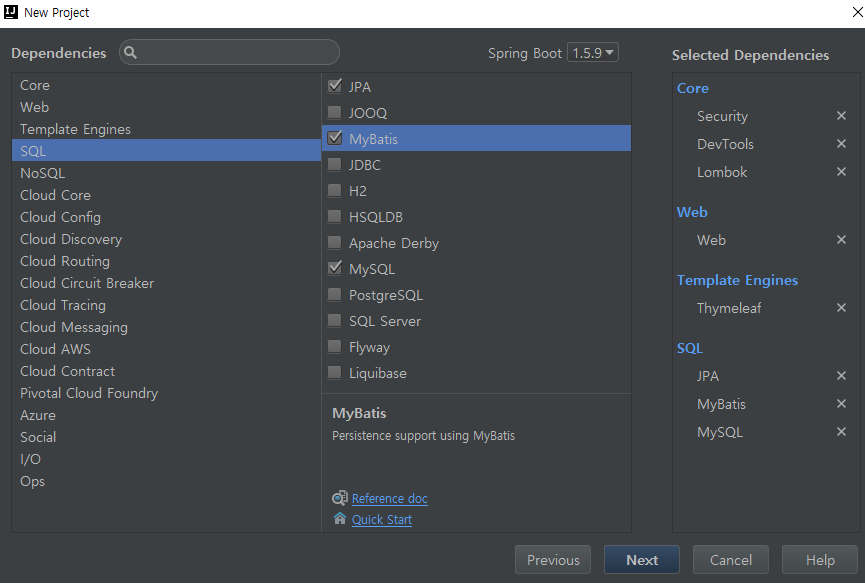
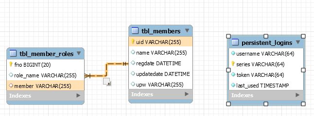

# ch08 Spring Web Security

> init project




> Authentication(인증) vs Authorization(인가)

e.g : 인증되고 Admin이라는 권한(인가)을 가진 사용자

> database - table



> Member.java

```
@Getter @Setter @EqualsAndHashCode(of="uid") @ToString
@Entity
@Table(name="tbl_members")
public class Member {
    @Id
    private String uid;
    private String upw;
    private String name;
    @CreationTimestamp
    private LocalDateTime regdate;
    @UpdateTimestamp
    private LocalDateTime updatedate;

    @OneToMany(cascade = CascadeType.ALL, fetch = FetchType.EAGER)
    @JoinColumn(name="member")
    private List<MemberRole> roles;
}
```

> MemberRole.java

```
@Getter @Setter @EqualsAndHashCode(of="fno") @ToString
@Entity
@Table(name="tbl_member_roles")
public class MemberRole {
    @Id
    @GeneratedValue(strategy = GenerationType.IDENTITY)
    private Long fno;
    private String roleName;
}
```

> 시큐리티 용어

- AuthenticationManager(인증매니저)
  - AuthenticationManagerBuilder (인증 매니저 빌더)
  - Authentication (인증)
- UserDetailsService 인터페이스
  - UserDetailsManager 인터페이스
- UserDetails 인터페이스
  - User 클래스

  


<br /><br /><br /><br /><br /><br /><br />


--------------------
