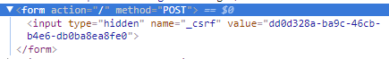
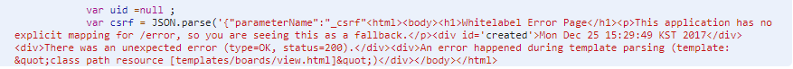

# Spring MVC와 Web Security 통합

> init project


#### CSRF
; GET 방식을 제외한 모든 경우 CSRF 토큰 값이 필요  
(설정에서 disable 하지 않는 이상)

=> Thymeleaf의 경우, form태그에 속성 추가하면 <hidden>이 자동 생성  
(method 설정을 안하면 왜 안생기는지 찾아야 됨)

> Auto csrf token

```
<form th:action="${'/'}" method="POST"></form>
```



> error : 만약 그대로 사용하면, 아래 같은 에러 발생
```
java.lang.IllegalStateException: Cannot create a session after the response has been committed
...
```



> Ajax :: reply.js

```
...
var add = function(obj, callback) {
  console.log("add...");
  $.ajax( {
    type : 'post',
    url : '/replies/' + obj.bno,
    data:JSON.stringify(obj),
    dataType:'json',
    beforeSend : function (xhr) {
      xhr.setRequestHeader(obj.csrf.headerName, obj.csrf.token);
    },
    contentType: 'application/json',
    success : callback
    });
};
...
```

#### 로그인 후 페이지 이동

> js code

```
var uid =[[${#authentication.principal} eq 'anonymousUser'? null :${#authentication.principal.member.uid}]] ;

var csrf = JSON.parse('[[${_csrf}]]');

$("#addReplyBtn").on('click', function() {
  if(uid == null){
    if(confirm("로그인 할까요?")){
      self.location = [[@{/login}]]+"?dest=" + encodeURIComponent(self.location);
    }
    return;
  }

  replyerObj.val(uid);

  $("#myModal").modal("show");
  $(".modal-title").text("Add Reply");

  $("#delModalBtn").hide();

  mode= "ADD";
});
```

> login interceptor :: prehandle

```
public class LoginCheckInterceptor extends HandlerInterceptorAdapter {
    @Override
    public boolean preHandle(HttpServletRequest request, HttpServletResponse response, Object handler) throws Exception {
        log.info("## pre handle");

        String dest = request.getParameter("dest");

        if(dest != null) {
            log.info("## exist dest : " + dest);
            request.getSession().setAttribute("dest", dest);
        }

        return super.preHandle(request, response, handler);
    }
}
```

> LoginSuccessHandler

```
public class LoginSuccessHandler extends SavedRequestAwareAuthenticationSuccessHandler {
    public LoginSuccessHandler() {
        log.info("## LoginSuccecssHandler()");
    }

    @Override
    protected String determineTargetUrl(HttpServletRequest request, HttpServletResponse response) {
        log.info("## --------------determineTargetUrl------------------------");
        Object dest = request.getSession().getAttribute("dest");

        String nextUrl = null;
        if(dest != null) {
            request.getSession().removeAttribute("dest");
            nextUrl = (String) dest;
        }
        else {
            nextUrl = super.determineTargetUrl(request,response);
        }

        log.info("## --------------"+ nextUrl + "------------------------");

        return nextUrl;
    }
}
```

> SecurityConfig

```
@Override
    protected void configure(HttpSecurity http) throws Exception {
        log.info("# security config..");
        http
                .authorizeRequests()
                    .antMatchers("/boards/list").permitAll()
                    .antMatchers("/boards/register").hasAnyRole("BASIC","MANAGER","ADMINS")
                .and()
                .formLogin()
                    .loginPage("/login")
                    .successHandler(new LoginSuccessHandler())
                .and()
                .exceptionHandling()
                    .accessDeniedPage("/accessDenied")
                .and()
                .logout()
                    .logoutUrl("/logout")
                    .invalidateHttpSession(true)
                .and()
                .rememberMe()
                    .key("zerock")
                    .userDetailsService(zerockUsersService)
                    .tokenRepository(getJDBCRepository())
                    .tokenValiditySeconds(60 * 60 * 24);
    }
```
