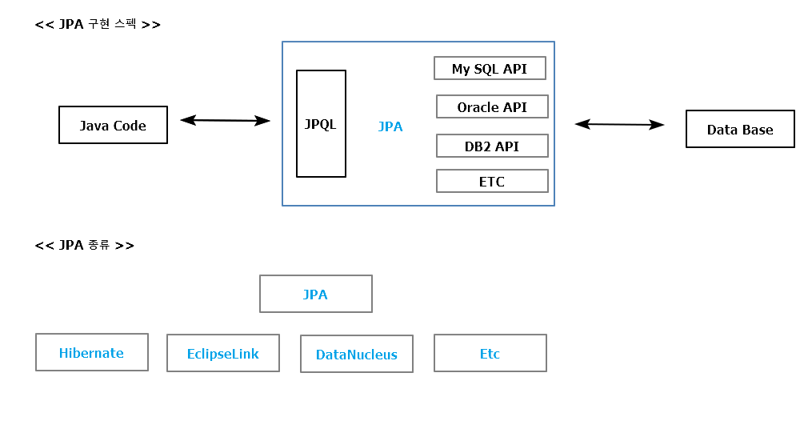
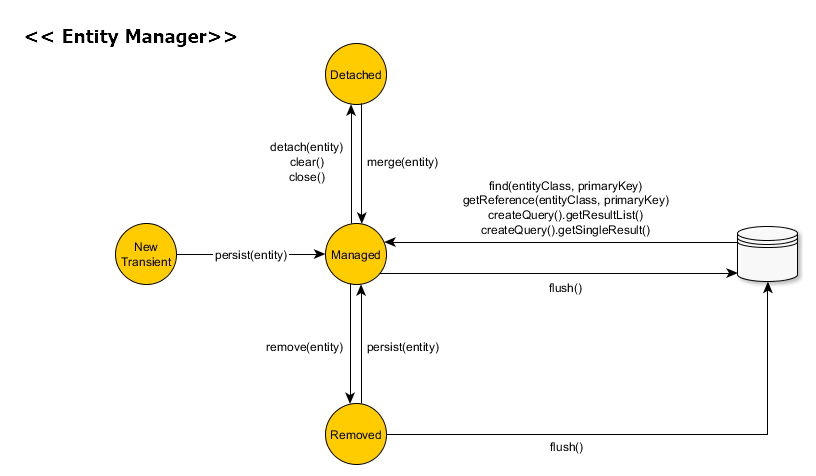

# JPA(Java Persistence API)

[move to learn.md](https://github.com/zacscoding/spring-boot-book/blob/master/learn.md)

docs
- [spring getting started](https://spring.io/guides/gs/accessing-data-jpa/)
-

> ORM (Object Relation Mapping) ?

<pre>
객체지향과 관계형 데이터베이스를 매핑 시킨다는 추상화 된 개념(vision?)  
-> JPA는 ORM의 개념을 Java 언어에서 구현하기 위한 스팩
</pre>

---

### JPA Archi

---

### JPA 장단점

***장점***  

- 데이터 베이스 관련 코드에 대한 유연함을 얻을 수 있음  
=> DB 변경은 프로그램 많이 바뀜 (DAO,VO, 화면, 서비스 등등)  
=> JPA는 DB 설계부터 Java 설계를 한번에 처리 가능

- 데이터베이스와 독립적 관계  
=> 특정 벤더의 데이터베이스에 종속적이지 않음(JPA에서 지원)  

***단점***  

- 학습 곡선(learning curve)이 큼
- 근본적인 객체지향 설계 사상이 반영되어야 함  
=> 어떻게 적합한 객체들의 관계를 작성 할 것인 가? 가 관건
- 특정 데이터베이스의 강력함을 활용할 수 없다는 문제  
=> SQL 튜닝 등의 작업에 제약이 생길 수 있음  
=> Native SQL을 제공하지만, DB와 종속적인 관계인 장점을 잃는 한계 등등

즉 **Application <-> JPA <->  JDBC <-> Database**

---

### 엔티티(Entity), 엔티티 매니저(Entity Manager)

#### Entity

> Member (Entity Type)

<table>
  <tr>
    <th>아이디</th><th>이름</th><th>연락처</th><th><< 컬럼/속성</th>
  </tr>
  <tr>
    <td>user01</td><td>name01</td><td>010-111-11111</td><td></td>
  </tr>
</table>

=> JPA에서 '하나의 엔티티 타입 생성 => 하나의 클래스를 작성'  
=> 회원 엔티티 == 회원 엔티티 클래스 || 회원 엔티티 인스턴스(객체) 혼용해서 사용 됨  

#### Entity Manager
; 여러 엔티티 객체를 관리

> Entity Object Life Cycle

[pic ref](https://vladmihalcea.com/2014/07/30/a-beginners-guide-to-jpa-hibernate-entity-state-transitions/)

- **New(비영속)**  
: Java 영역의 객체만 존재 & Database와 연동된 적이 없는 상태.  
(엔티티 매니저의 관리하에 있는 것이 아니므로 순수 Java 객체)  
- **Managed(영속)**  
: Database에 저장 & 메모리상에도 같은 상태로 존재하는 상태  
객체는 영속 컨텍스트 내에 들어가고 id(pk)값을 통해 필요한 엔티티 접근
- **Removed(삭제)**  
: 데이터베이스상에서 삭제된 상태, 영속 컨텍스트에 존재X  
- **Detached(준영속)**  
: 영속 컨텍스트에서 엔티티 객체를 꺼내서 사용하는 상태  
준영속 상태의 객체는 고유한 id(pk)값을 가지고 있지만, Database와 동기화는 이루어 지지   
않은 상태

=> 인터페이스를 설계하면, spring에서는 동적 프록시(Dynamic Proxy)를 이용해 실제 클래스 생성
