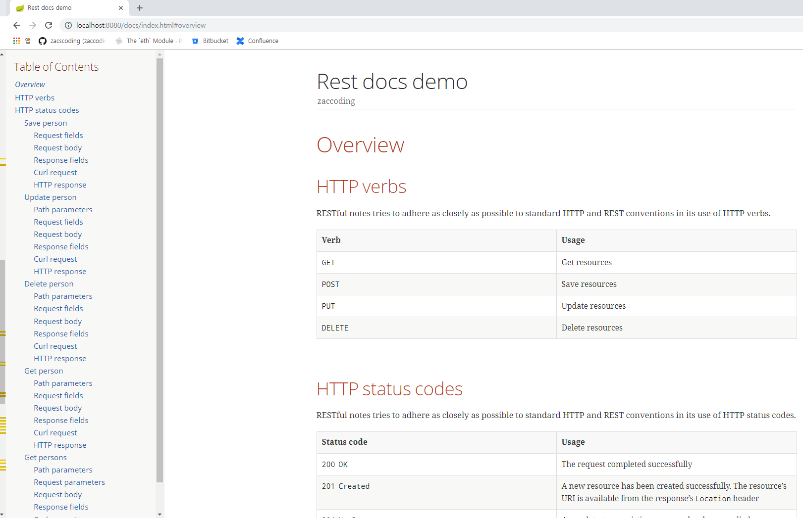
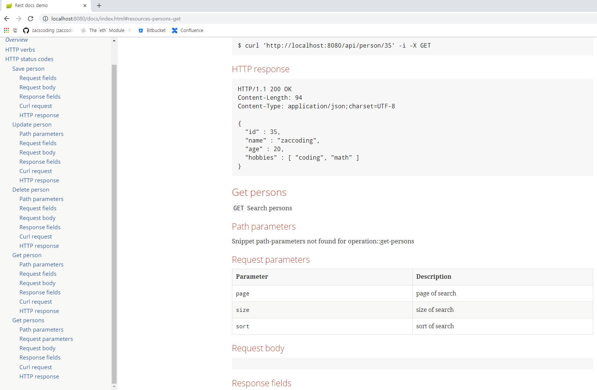

# Spring Rest Docs demo  

> Gererate rest docs  

```aidl
$ mvn clean install
$ mvn spring-boot:run
```  

http://127.0.0.1:8080/docs/index.html  

---  

> Docs results  

  





> maven  

```aidl
            ...
            <plugin>
                <groupId>org.springframework.boot</groupId>
                <artifactId>spring-boot-maven-plugin</artifactId>
            </plugin>
            <plugin>
                <groupId>org.asciidoctor</groupId>
                <artifactId>asciidoctor-maven-plugin</artifactId>
                <version>1.5.3</version>
                <executions>
                    <execution>
                        <id>generate-docs</id>
                        <phase>prepare-package</phase>
                        <goals>
                            <goal>process-asciidoc</goal>
                        </goals>
                        <configuration>
                            <backend>html</backend>
                            <doctype>book</doctype>
                            <attributes>
                                <snippets>${snippetsDirectory}</snippets>                                
                            </attributes>
                        </configuration>
                    </execution>
                </executions>
                <dependencies>
                    <dependency>
                        <groupId>org.springframework.restdocs</groupId>
                        <artifactId>spring-restdocs-asciidoctor</artifactId>
                        <version>2.0.3.RELEASE</version>
                    </dependency>
                </dependencies>
            </plugin>
            <plugin>
                <artifactId>maven-resources-plugin</artifactId>
                <version>2.7</version>
                <executions>
                    <execution>
                        <id>copy-resources</id>
                        <phase>prepare-package</phase>
                        <goals>
                            <goal>copy-resources</goal>
                        </goals>
                        <configuration>
                            <outputDirectory>${project.build.outputDirectory}/static/docs
                            </outputDirectory>
                            <resources>
                                <resource>
                                    <directory>${project.build.directory}/generated-docs</directory>
                                </resource>
                            </resources>
                        </configuration>
                    </execution>
                </executions>
            </plugin>
            ...
```  

> Testing code  

```aidl
	...
	
    @Test
    public void test_getPersons() throws Exception {
        // given
        IntStream.rangeClosed(1, 30).forEach(this::savePersons);

        // when then
        mockMvc.perform(get("/api/person")
            .param("page", "1")
            .param("size", "5")
            .param("sort", "name,DESC"))
            .andDo(print())
            .andDo(
                document("get-persons",
                    requestParameters(
                        parameterWithName("page").description("page of search"),
                        parameterWithName("size").description("size of search"),
                        parameterWithName("sort").description("sort of search")
                    ),
                    responseHeaders(
                        headerWithName(HttpHeaders.CONTENT_TYPE).description("Content type")
                    ),
                    responseFields(
                        fieldWithPath("content[]").type(JsonFieldType.ARRAY).description("searched content"),
                        fieldWithPath("content[].id").type(JsonFieldType.NUMBER).description("Id of a person"),
                        fieldWithPath("content[].name").type(JsonFieldType.STRING).description("name of a person"),
                        fieldWithPath("content[].age").type(JsonFieldType.NUMBER).description("age of a person"),
                        fieldWithPath("content[].hobbies").type(JsonFieldType.ARRAY).description("hobbies of a person"),

                        fieldWithPath("pageable.sort.sorted").description("sorted or not"),
                        fieldWithPath("pageable.sort.unsorted").description("unsorted or not"),
                        fieldWithPath("pageable.sort.empty").description("empty or not"),

                        fieldWithPath("pageable.offset").description("offset of search results"),
                        fieldWithPath("pageable.pageSize").description("page size of search results"),
                        fieldWithPath("pageable.pageNumber").description("page number of search results"),
                        fieldWithPath("pageable.paged").description("paged or not"),
                        fieldWithPath("pageable.unpaged").description("unpaged or not"),

                        fieldWithPath("totalPages").description("total pages of search results"),
                        fieldWithPath("totalElements").description("total number of elts"),
                        fieldWithPath("last").description("last or not"),
                        fieldWithPath("number").description("page number"),
                        fieldWithPath("size").description("elts size"),
                        fieldWithPath("sort.sorted").description("sorted or not"),
                        fieldWithPath("sort.unsorted").description("unsorted or not"),
                        fieldWithPath("sort.empty").description("empty or not"),
                        fieldWithPath("numberOfElements").description("elts number"),
                        fieldWithPath("first").description("first page or not"),
                        fieldWithPath("empty").description("empty or not")
                    )
                )
            );
    }
	
	...
```
