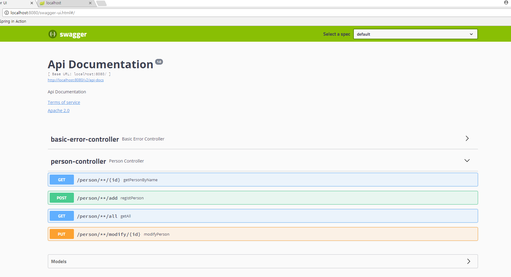

## Swagger2 sample

- ref :: http://springboot.tistory.com/24


#### 1. Maven dependencies

> pom.xml

```
<!-- https://mvnrepository.com/artifact/io.springfox/springfox-swagger2 -->
<dependency>
	<groupId>io.springfox</groupId>
	<artifactId>springfox-swagger2</artifactId>
	<version>2.8.0</version>
</dependency>

<!-- https://mvnrepository.com/artifact/io.springfox/springfox-swagger-ui -->
<dependency>
	<groupId>io.springfox</groupId>
	<artifactId>springfox-swagger-ui</artifactId>
	<version>2.8.0</version>
</dependency>
```

#### 2. Config Settings


> org.swaggerdemo.demo.config.SwaggerConfig  

```
package org.swaggerdemo.demo.config;

import org.springframework.context.annotation.Bean;
import org.springframework.context.annotation.Configuration;
import springfox.documentation.builders.PathSelectors;
import springfox.documentation.builders.RequestHandlerSelectors;
import springfox.documentation.spi.DocumentationType;
import springfox.documentation.spring.web.plugins.Docket;
import springfox.documentation.swagger2.annotations.EnableSwagger2;

@Configuration
@EnableSwagger2
public class SwaggerConfig {
    @Bean
    public Docket api() {
        return new Docket(DocumentationType.SWAGGER_2)
                .select()
                .apis(RequestHandlerSelectors.any())
                .paths(PathSelectors.any())
                .build();
    }
    private ApiInfo apiInfo() {
        return new ApiInfoBuilder()
            .title("Spring boot Swagger Demo")
            .description("This is demo app")
            .build();
    }
}
```

#### 3. Rest API (Controller)  

```
package org.swaggerdemo.demo.controller;

import com.google.gson.Gson;
import com.google.gson.GsonBuilder;
import io.swagger.annotations.ApiImplicitParam;
import io.swagger.annotations.ApiImplicitParams;
import io.swagger.annotations.ApiOperation;
import io.swagger.annotations.ApiResponse;
import io.swagger.annotations.ApiResponses;
import java.util.ArrayList;
import java.util.List;
import javax.annotation.PostConstruct;
import org.slf4j.Logger;
import org.slf4j.LoggerFactory;
import org.springframework.http.HttpStatus;
import org.springframework.http.ResponseEntity;
import org.springframework.web.bind.annotation.GetMapping;
import org.springframework.web.bind.annotation.PathVariable;
import org.springframework.web.bind.annotation.PostMapping;
import org.springframework.web.bind.annotation.PutMapping;
import org.springframework.web.bind.annotation.RequestBody;
import org.springframework.web.bind.annotation.RequestMapping;
import org.springframework.web.bind.annotation.RestController;
import org.swaggerdemo.demo.entity.Person;

/**
 * @author zacconding
 * @Date 2018-01-22
 * @GitHub : https://github.com/zacscoding
 */
@RestController
@RequestMapping("/person/**")
public class PersonController {

    private static final Logger logger = LoggerFactory.getLogger(PersonController.class);
    private List<Person> persons;
    private int seq = 0;
    private Gson gson;


    @PostConstruct
    public void setUp() {
        persons = new ArrayList<>();
        for (int i = 1; i < 10; i++) {
            Person p = new Person();
            p.setId(seq++);
            p.setName("name" + i);
            p.setAge(i);
            p.setHobby("hobby" + i);
            persons.add(p);
        }
        gson = new GsonBuilder().serializeNulls().setPrettyPrinting().create();
    }


    @ApiOperation(value = "Get person all")
    @ApiResponses({
        @ApiResponse(code = 200, message = "", response = String.class)
    })
    @GetMapping(produces = "application/json")
    public String getAll() {
        logger.info("## request person all");
        return gson.toJson(persons);
    }

    @ApiOperation(value = "Get one person by id")
    @ApiImplicitParam(name = "id", value = "Person`s id", required = true, dataType = "Integer")
    @GetMapping(value = "/{id}", produces = "application/json")
    public String getPersonById(@PathVariable("id") Integer id) {
        for (Person p : persons) {
            if (p.getId().equals(id)) {
                return gson.toJson(p);
            }
        }
        return "NULL";
    }

    @ApiOperation(value = "Add person")
    @PostMapping(produces = "application/json")
    public String registPerson(Person person) {
        person.setId(seq++);
        persons.add(person);
        return gson.toJson(person);
    }

    @ApiOperation(value = "Modify person info")
    @ApiImplicitParams({
        @ApiImplicitParam(name = "id", value = "Person`s id", required = true, dataType = "Integer", paramType = "path")
    })
    @ApiResponses({
        @ApiResponse(code = 200, message = "Success to modify"),
        @ApiResponse(code = 400, message = "Not exist id")
    })
    @PutMapping(value = "/{id}", produces = "application/json")
    public ResponseEntity<Void> modifyPerson(@PathVariable("id") Integer id, @RequestBody Person person) {
        person.setId(id);
        int idx = persons.indexOf(person);
        if (idx < 0) {
            return new ResponseEntity<>(HttpStatus.BAD_REQUEST);
        }

        Person prev = persons.get(idx);
        prev.setName(person.getName());
        prev.setAge(person.getAge());
        prev.setHobby(person.getHobby());

        return new ResponseEntity<>(HttpStatus.OK);
    }
}
```


#### 4. Confirm  

> http://localhost:8080/context/v2/api-docs

> http://localhost:8080/swagger-ui.html#/

